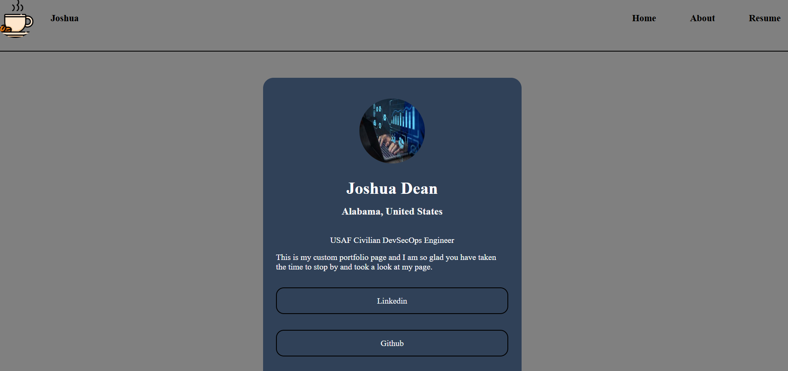

# Joshua Portfolio Website
This is my portfolio website in order to showcase my skills I have learned and apply those skills in a visible project

---

# Features
- **Responsive Design**: Optimized for mobile, tablet, and desktop devices.
- **Interactive Portfolio**: Showcases skills and projects with engaging visuals.
- **Easy Deployment**: Deployed using Docker for quick and simple setup.

---

# Technologies Used
- **HTML5**: For structuring the content.
- **CSS3**: For styling and responsive design.
- **Nginx (Alpine)**: Lightweight web server for serving the website.
- **Docker**: For containerizing the application.
- **Docker Compose**: For orchestrating multi-container setups.

---

# Want setup my site locally? 

### Prerequisites
- Ensure **Docker** and **Docker Compose** are installed on your system.
  - [Install Docker](https://docs.docker.com/get-docker/)
  - [Install Docker Compose](https://docs.docker.com/compose/install/)

### Steps
1. **Clone master repository**:
    ```bash
    git clone https://github.com/jdeantech/joshua_portfolio_website.git
    cd joshua_portfolio_website

2. **Build the Docker image**:
    ```bash
docker build -t my-portfolio-nginx-image .

3. **Run the Docker container**
    ```bash
docker-compose up

4. **Open the static site in your local browser**
    - Go To:
 https://localhost:8099

5. **Done** You should now see the homepage of my website!
   
## Screenshots

### Homepage



## Deployment
The website is live and accessible at: [https://jdeantech.github.io/Joshua_Portfolio_Website/](https://jdeantech.github.io/Joshua_Portfolio_Website/)  
It is hosted using GitHub Pages for easy access and sharing.
## License
This project is licensed under the MIT License. See the 

## Contributing

### I am actively working on my own features to the site, but other contributions are welcome!###
    
Please follow these steps:

1. Fork the Repository to your Github account

2. Create a new branch:
git checkout -b your-new-feature-name

3. Once done coding your new feature you can commit your changes:
git commit -m "Added New Feature"

4. Push to your branch:
git push origin "your-new-feature-name"

5. Open a pull request to merge your branch to mine on my repository

# Issues or Bugs
If you find any issues with my repository feel free to open up a issue ticket and I will get to it as soon as possible.
